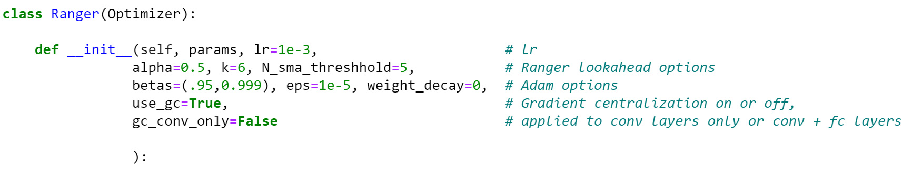
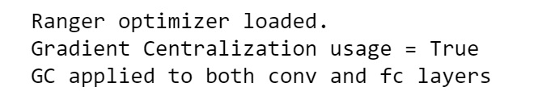

# Ranger-Deep-Learning-Optimizer 
</br>
Ranger - a synergistic optimizer combining RAdam (Rectified Adam) and LookAhead, and now GC (gradient centralization) in one optimizer.
</br>

#### quick note - Ranger21 is now in beta and is Ranger with a host of new improvements.  
Recommend you compare results with Ranger21:  https://github.com/lessw2020/Ranger21

### Latest version 20.9.4 - updates Gradient Centralization to GC2 (thanks to GC developer) and removes addcmul_ deprecation warnings in PyTorch 1.60. 
</br> </br>
*Latest version is in ranger2020.py - looking at a few other additions before integrating into the main ranger.py.  

What is Gradient Centralization? = "GC can be viewed as a projected gradient descent method with a constrained loss function. The Lipschitzness of the constrained loss function and its gradient is better so that the training process becomes more efficient and stable."  Source paper:  https://arxiv.org/abs/2004.01461v2
</br>
Ranger now uses Gradient Centralization by default, and applies it to all conv and fc layers by default.  However, everything is customizable so you can test with and without on your own datasets.  (Turn on off via "use_gc" flag at init).
</br>
### Best training results - use a 75% flat lr, then step down and run lower lr for 25%, or cosine descend last 25%. 

</br> Per extensive testing - It's important to note that simply running one learning rate the entire time will not produce optimal results.  
Effectively Ranger will end up 'hovering' around the optimal zone, but can't descend into it unless it has some additional run time at a lower rate to drop down into the optimal valley.

### Full customization at init: 
<div  align="center"></div>
</br>
Ranger will now print out id and gc settings at init so you can confirm the optimizer settings at train time:
<div  align="center"></div>

/////////////////////

Medium article with more info:  
https://medium.com/@lessw/new-deep-learning-optimizer-ranger-synergistic-combination-of-radam-lookahead-for-the-best-of-2dc83f79a48d

Multiple updates:
1 - Ranger is the optimizer we used to beat the high scores for 12 different categories on the FastAI leaderboards!  (Previous records all held with AdamW optimizer).

2 - Highly recommend combining Ranger with: Mish activation function, and flat+ cosine anneal training curve.

3 - Based on that, also found .95 is better than .90 for beta1 (momentum) param (ala betas=(0.95, 0.999)).

Fixes:
1 - Differential Group learning rates now supported.  This was fix in RAdam and ported here thanks to @sholderbach.
2 - save and then load may leave first run weights stranded in memory, slowing down future runs = fixed.

### Installation
Clone the repo, cd into it and install it in editable mode (`-e` option).
That way, these is no more need to re-install the package after modification.
```bash
git clone https://github.com/lessw2020/Ranger-Deep-Learning-Optimizer
cd Ranger-Deep-Learning-Optimizer
pip install -e . 
```

### Usage 
```python
from ranger import Ranger  # this is from ranger.py
from ranger import RangerVA  # this is from ranger913A.py
from ranger import RangerQH  # this is from rangerqh.py

# Define your model
model = ...
# Each of the Ranger, RangerVA, RangerQH have different parameters.
optimizer = Ranger(model.parameters(), **kwargs)
```
Usage and notebook to test are available here:
https://github.com/lessw2020/Ranger-Mish-ImageWoof-5

### Citing this work

We recommend you use the following to cite Ranger in your publications:

```
@misc{Ranger,
  author = {Wright, Less},
  title = {Ranger - a synergistic optimizer.},
  year = {2019},
  publisher = {GitHub},
  journal = {GitHub repository},
  howpublished = {\url{https://github.com/lessw2020/Ranger-Deep-Learning-Optimizer}}
}
```
